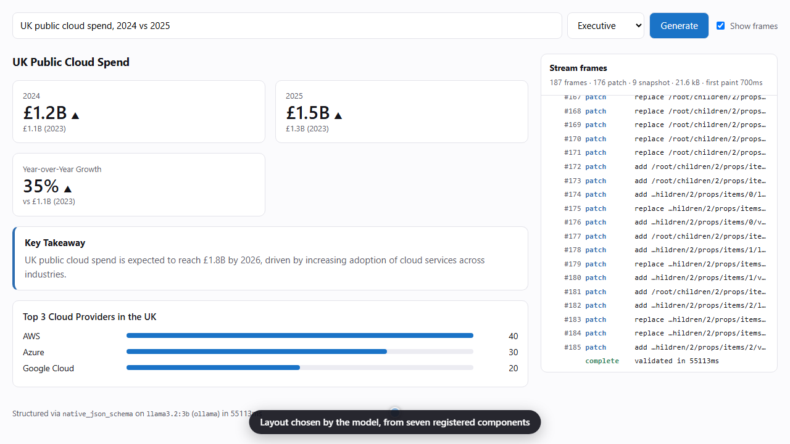
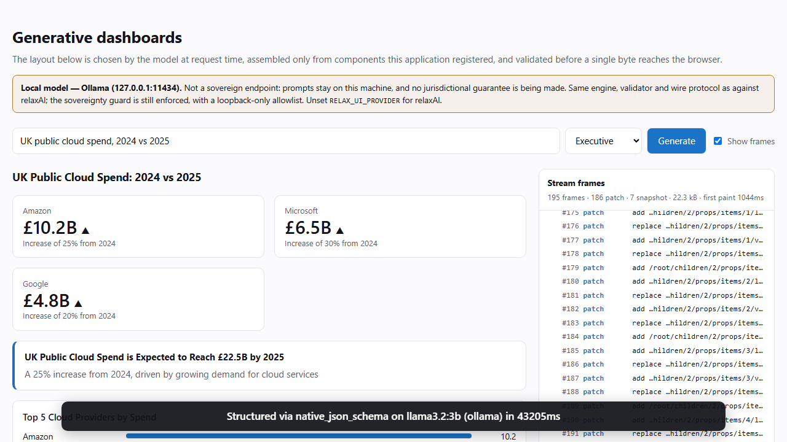

<div align="center">

# relaxAI Generative UI SDK

**Stream schema-validated, model-designed interfaces from [Civo relaxAI](https://www.civo.com/ai/relaxai) — safely, on the edge, without leaving UK jurisdiction.**

`relax-ui-core` · `relax-ui-react` · `relax-ui-next`

TypeScript · Zod 3 & 4 · Next.js App Router · zero runtime dependencies in core

</div>

---

## The problem this solves

relaxAI gives UK organisations frontier open-weight models inside UK legal
jurisdiction, behind an API that is **1:1 compatible with OpenAI's**. For a team
that wants *generative UI* — interfaces whose structure a model decides at request
time — that compatibility solves transport and nothing else.

What is left is the awkward part:

| Gap | Why it bites |
|---|---|
| **Capability ≠ parity** | `response_format: json_schema` is a *server* feature. Whether a given open-weight model honours it is not discoverable from the protocol, and the catalogue changes as models land. |
| **Streaming vs parsing** | A blank screen for four seconds reads as broken. But a half-written JSON document cannot be parsed, and waiting for the last token throws the requirement away. |
| **Untrusted structure** | Model output that becomes UI is attacker-influenced markup. No frontend reviewer approves rendering it as-is. |
| **Two sources of truth** | You have a Zod schema. You do not want a hand-maintained JSON Schema beside it, drifting. |
| **Response wrappers** | DeepSeek R1 emits `<think>`. GPT-OSS emits harmony channels. Llama adds fences and pleasantries. All break `JSON.parse`. |

Today every team solves these per-application, badly, by whoever gets the ticket.

## What this SDK does about it

```ts
// One declaration. It becomes the JSON Schema relaxAI is sent, the server-side
// validator, the TypeScript type, and the renderer's lookup table.
const registry = createUIRegistry({
  Stack:  { props: z.object({ heading: displayText(120).optional() }), children: "required" },
  Metric: { props: z.object({ label: displayText(60), value: displayText(24) }) },
  Source: { props: z.object({ label: displayText(80), href: urlString({ schemes: ["https:"] }) }) },
});
```

```ts
// app/api/ui/route.ts — the whole server side.
export const runtime = "edge";
export const POST = createGenerativeUIRoute({
  client: new RelaxClient(),
  model: "Llama-4-Maverick-17B-128E",
  schema: registry.structuredSchema("Dashboard"),
  inputSchema: z.object({ topic: z.string().min(3).max(300) }),
  toMessages: (input) => [{ role: "user", content: `Dashboard about: ${input.topic}` }],
});
```

```tsx
// app/page.tsx — the whole client side.
const { object, isStreaming, submit } = useGenerativeObject<{ root: UINode }>({ api: "/api/ui" });
<Dashboard node={object?.root} />
```

That is 27 lines across three files, and what you get is a layout the model chose,
streaming in, every node validated before it renders, with nothing outside your
vocabulary able to appear.

→ **[Quickstart](./specs/001-generative-ui-sdk/quickstart.md)** ·
**[Reference app](./examples/next-app)** · **[API reference](./docs/api-reference.md)**

### Watch the walkthrough

[](https://youtu.be/77KEdBJBsKs)

**[▶ Narrated walkthrough on YouTube](https://youtu.be/77KEdBJBsKs)** (5 min) — the
app is opened and used like a user would, while a narrator explains what is
happening underneath: where the question is sent, what each frame is, how the
model is kept to the schema, what testing against a real model found, and the
trade-offs. The same file is in the repository as
[`docs/demo/relax-ui-walkthrough.mp4`](./docs/demo/relax-ui-walkthrough.mp4).

Picture, voice and model all ran on one laptop: Playwright drives the real app,
[Piper](https://github.com/OHF-Voice/piper1-gpl) reads the script, and
`llama3.2:3b` on Ollama answers. `pnpm demo:narrated` regenerates it; the script
is [`narration.json`](./examples/next-app/demo/narration.json).

### See it run — on your own machine, with no account

[](./docs/demo/generative-ui-local-model.webm)

**[▶ Demo video](./docs/demo/generative-ui-local-model.webm)** — a real generation
from `llama3.2:3b` on local Ollama: about 200 frames, each validated server-side
before the browser saw it. Recorded by a committed script (`pnpm demo:record`), so
it can be regenerated rather than trusted. The figures on screen are the model's
invention, not data: a schema constrains shape, not truth.

```bash
ollama pull qwen2.5:3b
pnpm install && pnpm build
RELAX_UI_PROVIDER=ollama pnpm --filter relax-ui-example-next dev   # then open /?frames=1
pnpm frames                                                        # or watch the frames in a terminal
```

relaxAI is the default endpoint and the reason the SDK exists; it is not a
requirement of the engine. → **[Local quickstart](./specs/002-provider-agnostic-inference/quickstart.md)**

---

## How it works

### Capability is negotiated, never assumed

Three ways to get schema-conformant JSON, tried strongest-first, downgrading when
the server says no — and **remembering**, so a wrong guess costs one request per
model per process rather than one per call.

| Tier | Mechanism | Guarantee |
|---|---|---|
| 1 | `response_format: json_schema` | Shape violations are *impossible* — invalid tokens are never sampled |
| 2 | Forced tool call | Clean JSON, no prose; what most of the catalogue actually uses |
| 3 | Schema in the prompt | Works on any chat model; the floor, so a wrong table never fails |

The strategy used and any downgrades come back in `metadata`. Silent degradation
is a debugging tax we refuse to levy.

→ [ADR-0002](./docs/adr/0002-capability-negotiated-structuring-ladder.md) ·
[ladder diagram](./docs/diagrams/03-structuring-ladder.md)

### Partial JSON, parsed properly

The model has written `{"title":"Quarterly rev`. You want "Quarterly rev" on
screen now.

| Buffer | Yields | Why |
|---|---|---|
| `{"title":"Quarterly rev` | `{"title":"Quarterly rev"}` | Progressive prose is the point of streaming |
| `{"a":1,"ti` | `{"a":1}` | A half-named key would lie about the object's shape |
| `{"ok":tru` | `{}` | Incomplete literal rewinds |
| `{"s":"a\` | `{"s":"a"}` | Dangling escape trimmed, or the repair itself breaks |

Tested against **every prefix** of a realistic document, because these are the
cases no human thinks to type.

→ [scanner state machine](./docs/diagrams/07-partial-json-state.md)

### Validation that understands "not finished yet"

Mid-stream the object is *supposed* to be incomplete. Rather than derive a
deep-partial schema — removed in Zod 4, and fragile in 3 — the SDK runs your real
schema and classifies what it complains about:

- **pending** — missing key, short string, half-spelled enum → tolerated while the
  stream is open;
- **fatal** — wrong type, unknown key → the stream stops *now*.

So a `score: "nine"` detected on token 4 does not cost the remaining 2,000 tokens.
It also happens to work identically on Zod 3 and Zod 4.

→ [ADR-0005](./docs/adr/0005-streaming-partial-validation.md)

### Model output is untrusted input

Generative UI moves the XSS surface from *what the developer wrote* to *what the
model was persuaded to write*. The mitigation is a closed vocabulary, not a
sanitiser:

- the legal `type` set is **closed at schema-construction time** — an unregistered
  component has no branch in the union, so a document naming it fails validation;
- props are validated per component, and objects are `.strict()`, so a smuggled
  `onClick` is a failure rather than a silent drop;
- `urlString()` rejects `javascript:` at **validation** time, before a frame is
  sent — `z.string().url()` would accept it;
- there is **no `dangerouslySetInnerHTML` anywhere in the SDK**, and CI greps for
  it;
- documents are size- and depth-bounded, checked iteratively — a recursive check
  overflows the stack while measuring, i.e. the guard fails before it fires.

Every one of those has a test asserting the *refusal*.

→ [Security model](./docs/security-model.md) ·
[trust boundaries](./docs/diagrams/06-trust-boundaries.md)

### Sovereignty is not a setting

relaxAI's reason to exist is jurisdictional. An SDK that quietly accepts any
`baseURL` or ships a telemetry beacon hands that back without the buyer noticing.

- the endpoint host is allowlisted, checked in the **constructor**, so a
  misconfigured `RELAX_BASE_URL` fails the deploy rather than exfiltrating prompts;
- plaintext HTTP is refused (loopback needs an explicit opt-in that cannot widen
  to a remote host);
- **zero runtime dependencies in core** — the whole egress path is auditable in an
  afternoon;
- there is no analytics endpoint, no version check, no error reporter. Observability
  is in-process counters you export yourself.

→ [ADR-0003](./docs/adr/0003-no-openai-sdk-dependency.md)

### Loosely coupled, without loosening the guard

The engine depends on an `InferenceClient` interface, not on relaxAI. Which
endpoint a client talks to is a **provider profile** — data: an address, an
egress allowlist, whether a key is needed, whether it is sovereign.

```ts
new RelaxClient();                       // relaxAI. Nothing can redirect it.
createClient();                          // RELAX_UI_PROVIDER, else relaxAI.
createClient({ provider: "ollama" });    // a local open-weight model. No key.
createClient({ provider: defineProvider({ … }) });   // your own endpoint.
```

Built in: `relaxai`, `ollama`, `lmstudio`, `llamacpp`. What makes that safe rather
than a hole in Principle I:

- **the guard runs for every provider** — a local profile carries a loopback-only
  allowlist, and an environment variable can move its address but not widen it;
- **no fallback** — a misspelt provider name is a configuration error, never a
  silent default to the hosted endpoint;
- **the provider travels with the result** — `meta.provider` on the wire,
  `metadata.provider` on completion, and only relaxAI is ever `sovereign`;
- **capability is per endpoint** — the same weights behind two servers differ, so
  what is learned about a model on one endpoint is never applied to another.

Running against a real local model is how three frame-creation bugs were found
that the scripted tests could not see: a tool call that returns nothing, a
runtime that accepts a schema and silently does not enforce it, and an upstream
generation left running after the SDK had stopped reading it.

→ [ADR-0007](./docs/adr/0007-provider-profiles-and-inference-interface.md) ·
[ADR-0008](./docs/adr/0008-wire-schema-dialects.md) ·
[what was measured](./specs/002-provider-agnostic-inference/research.md)

---

## Packages

| Package | Responsibility | Runtime deps |
|---|---|---|
| [`relax-ui-core`](./packages/core) | Transport, negotiation, strategies, streaming parse + validate, guards, wire protocol | none (Zod is a peer) |
| [`relax-ui-react`](./packages/react) | Streaming object hook, allowlist-only renderer | core, React |
| [`relax-ui-next`](./packages/next) | App Router handler factories | core |

Core runs unchanged on **Node ≥ 20, Vercel Edge, Cloudflare Workers, Bun and
Deno**: `fetch` is the only platform API it requires, and it imports nothing from
`node:`.

### On the package names

The packages are unscoped on purpose. `@civo/*` is Civo's npm namespace, and
publishing into a namespace you do not own is not a thing to do quietly — so
those names are left free in case Civo adopts this work. If they do, the rename
is a find-and-replace.

---

## How this repository is built

Developed with [GitHub Spec Kit](https://github.com/github/spec-kit):
**constitution → specify → clarify → plan → tasks → implement**. The artefacts are
the review surface — code review of a 4,000-line SDK cannot recover the intent a
spec would have stated in a page.

| Artefact | What it holds |
|---|---|
| [Constitution](./.specify/memory/constitution.md) | Seven principles, gated twice per feature |
| [Specification](./specs/001-generative-ui-sdk/spec.md) | Scenarios, 26 functional + 8 non-functional requirements, clarifications |
| [Research](./specs/001-generative-ui-sdk/research.md) | Nine investigations, with what was **rejected** and why |
| [Plan](./specs/001-generative-ui-sdk/plan.md) | Constitution checks, design decisions, known limitations |
| [Data model](./specs/001-generative-ui-sdk/data-model.md) | Nine entities with their invariants |
| [Contracts](./specs/001-generative-ui-sdk/contracts/) | Wire protocol, upstream assumptions, public API |
| [Tasks](./specs/001-generative-ui-sdk/tasks.md) | 70 dependency-ordered tasks (68 complete, 2 outstanding), tests before implementation |

Feature 002 — [provider-agnostic inference](./specs/002-provider-agnostic-inference/spec.md)
— has the same chain: [spec](./specs/002-provider-agnostic-inference/spec.md) ·
[research](./specs/002-provider-agnostic-inference/research.md) (measured against
a live local runtime) · [plan](./specs/002-provider-agnostic-inference/plan.md) ·
[data model](./specs/002-provider-agnostic-inference/data-model.md) ·
[contract](./specs/002-provider-agnostic-inference/contracts/provider-profile.md) ·
[tasks](./specs/002-provider-agnostic-inference/tasks.md). It amended the
constitution to v1.1.0.

### Design documentation

| Document | For |
|---|---|
| [HLD](./docs/hld.md) | Context, containers, lifecycle, quality attributes, risks |
| [LLD](./docs/lld.md) | Module internals, algorithms, complexity, the cases that motivated them |
| [Security model](./docs/security-model.md) | Assets, adversaries, controls — and what is *not* defended |
| [ADRs](./docs/adr/) | Eight load-bearing decisions, each with its rejected alternatives |
| [Diagrams](./docs/diagrams/) | Eight Mermaid diagrams, all render-verified |
| [API reference](./docs/api-reference.md) | Every export, with examples |
| [Troubleshooting](./docs/troubleshooting.md) | Symptoms first |

---

## Development

```bash
pnpm install
pnpm verify           # typecheck + tests + build
pnpm probe:selftest   # verifies scripts/probe-models.ts against a stub
pnpm diagrams:check   # renders every fenced mermaid block
pnpm test:e2e         # 20 browser tests against two stand-in endpoints
pnpm frames           # one real generation on local Ollama, every frame checked
pnpm demo:record      # regenerate the demo video

cd examples/next-app && pnpm dev
```

The reference app runs against **a local model with no relaxAI account** —
`RELAX_UI_PROVIDER=ollama pnpm dev` (also `lmstudio`, `llamacpp`). It
auto-discovers whichever model you have pulled. The sovereignty guard still
runs, on a loopback-only policy, and the UI says plainly that it is not a
sovereign endpoint. See [the example's README](./examples/next-app/README.md).

`pnpm frames` is the tool to reach for after upgrading a local runtime: it prints
each frame as it is created and asserts the wire contract's sequencing rules and
that replaying the frames reproduces the completed value.

`pnpm probe` needs Node ≥ 22.9 (it runs TypeScript directly via
`--experimental-strip-types`, and loads `.env` via `--env-file-if-exists`);
everything else needs Node ≥ 20.11.

pnpm is required, not a preference: the workspace uses the `workspace:` protocol,
which plain `npm install` rejects. The `packageManager` field pins the version, so
Corepack will fetch it.

The test suite runs entirely against injected `fetch`, `sleep`, `random` and `now`,
so it exercises real code paths — the actual client, the actual retry loop — with
no network and no wall-clock waiting. There are no module mocks.

| Suite | Tests | Emphasis |
|---|---|---|
| Partial JSON | 25 | Rewind rules, escapes, **every prefix** of a realistic document, and that no prefix loses a member an earlier one had |
| JSON Patch | 12 | Round-trip, array ordering, structural sharing |
| JSON Schema | 14 | Constraints, unions, `$defs` recursion, deliberate throws |
| Guards | 19 | Every refusal path |
| UI contract | 15 | Unknown components, bad props, `javascript:`, a 200k-deep tree |
| Orchestration | 17 | Each tier, downgrade + persistence, repair, full ladder walk |
| React | 20 | Renderer refusals, escaping, keying; stream decoding |
| Next route | 10 | Input rejection, smuggled model/system, status mapping |
| Providers | 36 | Mostly refusals: unknown name, remote host on a local profile, env trying to widen the allowlist |
| Schema dialect | 10 | Keyword removed everywhere it is a keyword, kept where it is a name; validator unchanged |
| Frame creation | 29 | Cases first seen on a real local model: empty tool call, lazy `meta`, upstream cancelled on early exit |
| Browser (Playwright) | 20 | Two app instances: a runtime that honours constrained decoding, and one that refuses it |

---

## Status and honest caveats

Feature-complete and tested, **not yet published**. Two things a reviewer should
know:

1. **The capability priors are not yet verified against the live API.** This was
   built in an environment whose egress policy blocks `relax.ai`, so the per-model
   table is assembled from Civo's published documentation and each entry carries a
   `note` saying so. The architecture absorbs a wrong prior — one wasted request
   per model per process, never a failure, because the floor strategy needs no
   server feature at all.

   Closing it is one command with a key. Put it in `.env` (gitignored, and
   loaded automatically) so it never reaches a command line or shell history:

   ```bash
   cp .env.example .env    # then fill in RELAX_API_KEY
   pnpm build && pnpm probe
   ```

   `scripts/probe-models.ts` probes every catalogue model for constrained
   decoding, tool calling, `json_object`, streaming and reasoning traces, prints
   where reality disagrees with the shipped priors, and emits a paste-ready
   `CapabilityRegistry` seed. It drives the SDK's own client, so a run also
   exercises the transport and the rejection classifier against the live API.

   The probe itself is verified: `pnpm probe:selftest` runs it against four stub
   models with deliberately awkward behaviour and asserts its conclusions. That
   self-test caught two real bugs the first time it ran.
2. **The local-runtime profiles are measured for one runtime, at one version.**
   Ollama 0.35.0 was on the bench and its two refinements (constrained decoding
   works; `pattern` silently disables it) are measurements. `lmstudio` and
   `llamacpp` are an address and a loopback policy, nothing more, and say so.
   `pnpm frames -- --provider <name>` is the re-measurement.
3. **Other known limitations** — the Zod → JSON Schema subset, positional array
   diffing, no built-in rate limiting — are listed in
   [plan.md](./specs/001-generative-ui-sdk/plan.md#known-limitations) rather than
   left to be discovered.

---

## Licence

[Apache-2.0](./LICENSE).

Not an official Civo project, and not affiliated with or endorsed by Civo. Built
as a proof-of-work prototype against relaxAI's public API surface. "Civo" and
"relaxAI" are Civo's marks, used here only to say what this integrates with.
