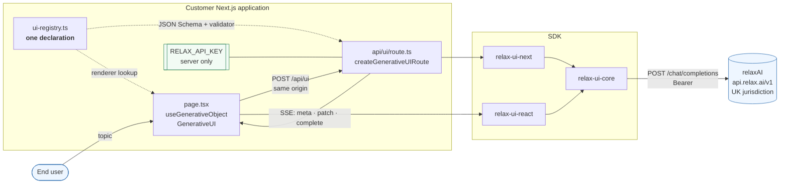

# Context

## What the diagram is drawn to make obvious

**The credential has exactly one home.** It is read by the route handler at cold
start and never enters a client bundle. The browser talks only to its own origin;
it has no relaxAI endpoint, no model name it could change, and no key.

**The registry is declared once and read twice.** The dotted lines are the same
file. On the server it becomes the JSON Schema relaxAI is sent and the validator
that gates every frame; on the client it becomes the renderer's lookup table.
Nothing has to be kept in sync because there is only one thing.

**The SSE arrow carries validated objects, not tokens.** That is
[ADR-0001](../adr/0001-server-side-validation-boundary.md), and it is why the
React package can be credential-free and model-agnostic.
