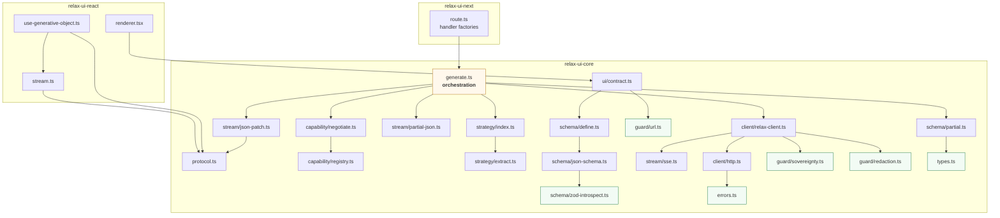

# Containers and module dependencies

## Reading the dependency direction

**Guards and types are leaves** (green). Nothing in the SDK depends on them
transitively in a way that could route around them, and they are individually
testable with no fixtures. `guard/sovereignty.ts` has exactly one caller — the
`RelaxClient` constructor — and that constructor is the only way to reach the
network. `guard/url.ts` has exactly one caller in the UI path — `urlString()` —
and that is the only way a URL prop enters a schema.

**`generate.ts` is the only orchestrator** (amber). It is the single place where
negotiation, strategy, extraction, parsing, validation and diffing meet. That
concentration is deliberate: the ordering constraints between those steps are the
subtle part of the system, and they are easier to review in one file than
distributed across six.

**The three packages form a chain, not a web.** `react` never imports `next`;
`next` never imports `react`; neither imports the other's internals. That is what
lets a Cloudflare Worker use `generateObject` without React entering its bundle.
