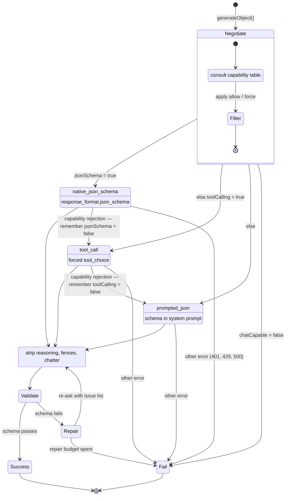

# The structuring ladder

## The two rules that make this safe

**Only a capability rejection drops a tier.** The `Tier1 --> Fail` edges matter as
much as the downgrade edges: a 401, a 429 or a 500 propagates unchanged. Silently
downgrading on any error would mask an auth failure as a quality problem, and a
downgrade is not free — it costs the guarantee.

**Exhausting repairs does not drop a tier.** Notice that `Repair --> Fail` exits
the machine rather than stepping down. A model that can call tools but writes bad
arguments will not do better with a weaker mechanism; the fault is in the content,
not the channel, and repair is the tool for content.

## Why the "remember" annotations matter

Each downgrade writes back to the process-wide `CapabilityRegistry`. Without that,
a wrong prior costs one wasted request *per call*. With it, it costs one per model
per process — which is why it is safe to ship optimistic priors for models we
could not verify against the live API.

## Where the floor sits

`prompted_json` requires no server feature at all: only a chat model that can be
asked for JSON. That is why a completely wrong capability table degrades to "one
wasted request and a slightly larger prompt" rather than to a failure.
