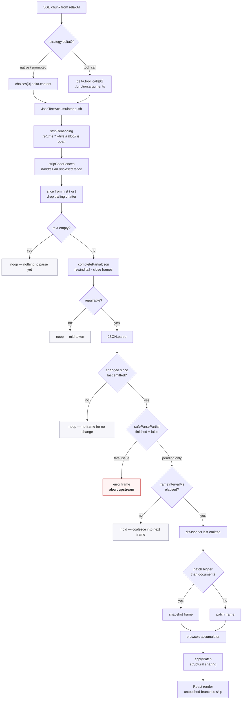

# Streaming pipeline

## The four `noop` paths

Most deltas produce no frame, and that is the design working rather than failing:

- **Reasoning still open.** DeepSeek R1 can spend hundreds of tokens inside
  `<think>` before the document starts. `stripReasoning` returns the empty string
  throughout, which is the correct answer to "what JSON has arrived": none. Handing
  that prose to the parser would find a `{` inside a sentence.
- **Mid-token.** `{"a":1,"ti` has no repairable form that includes the partial key,
  so the frame is skipped rather than emitting a document with a half-named field.
- **No change.** Two deltas can land inside the same incomplete value without
  changing the parsed document. No frame for no change.
- **Throttled.** At `frameIntervalMs: 50`, roughly one frame in ten survives on a
  fast model. Nothing is lost: the flush at end-of-stream emits whatever the
  throttle held back.

## The one stop path

A **fatal** validation issue — wrong type, unknown key — aborts the upstream
request immediately. This is the concrete payoff of
[ADR-0005](../adr/0005-streaming-partial-validation.md): a `score: "nine"` detected
on token 4 does not cost the remaining 2,000 tokens. A *pending* issue at the same
point is expected and ignored.
