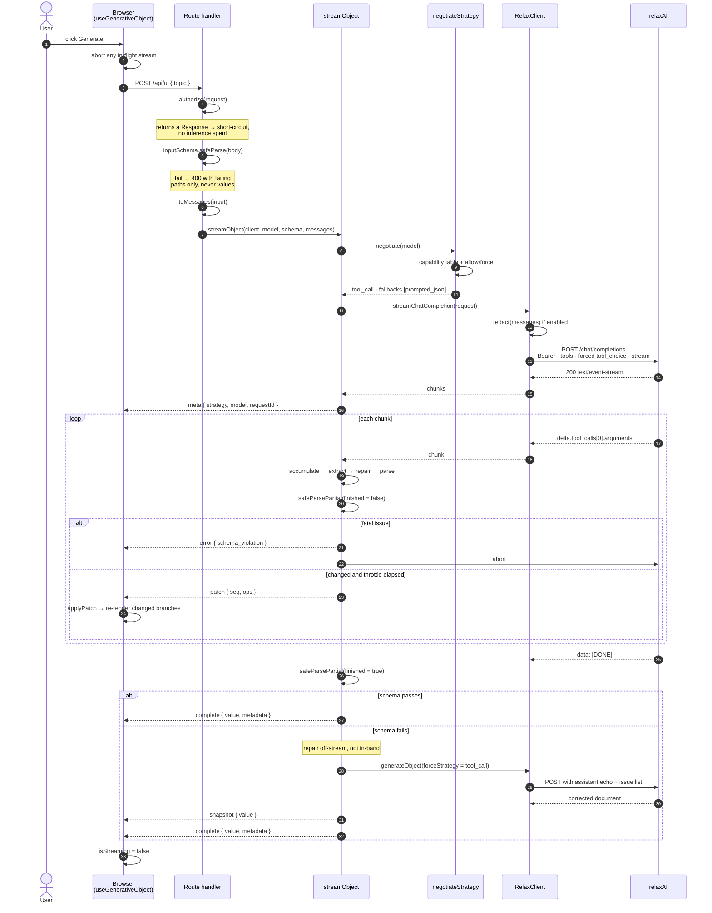

# Request lifecycle

## Points worth reading twice

**Steps 4–6 precede any inference.** Authorisation, body validation and prompt
assembly all happen before a token is spent. A malformed request costs nothing, and
a failing body returns 400 with the failing *paths* — the values may be personal
data.

**Step 2 is not decoration.** A second click while a stream is open must abort the
first, or two streams race into one accumulator and the `seq` assertion fires.

**The abort in the fatal branch flows back to relaxAI.** `request.signal` is passed
through the route into `streamObject` into the client, so a closed tab or a fatal
validation issue cancels the upstream generation rather than paying for tokens
nobody will read.

**The repair is off-stream and emits a snapshot.** Patching a repaired document
against a broken one is not meaningful, so the protocol replaces the document
wholesale. That is also why downgrading is illegal once the first frame has been
sent — there is no frame meaning "forget everything I said".
