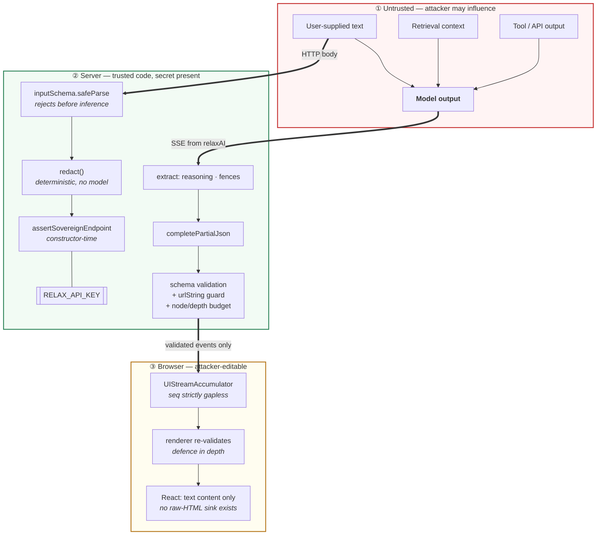

# Trust boundaries

## The three thick arrows are the boundaries

**① → ②, user text.** Crosses via `inputSchema`. Anything that fails is a 400, not
a prompt. This is also where a smuggled `model` or `system` field is discarded:
those come from the route's closure, so the type signature makes client control
unexpressible.

**① → ②, model output.** This is the arrow most implementations get wrong by not
having it — by streaming tokens to the browser, the boundary moves to ③ where an
attacker can edit the code enforcing it. Here everything downstream of it runs on
the server.

**② → ③.** Only validated events cross. The browser receives a document that has
already passed the schema, the URL guard and the size budget.

## Why ③ still has controls

The renderer re-validates every node before calling a component, and the
accumulator refuses an out-of-order `seq`. Neither is load-bearing — ② already
guaranteed both. They exist because a control that lives in exactly one layer is a
control a misconfiguration silently removes, and the cost here is a map lookup and
a `safeParse`. The failure they guard against — a malformed tree reaching the DOM
because one layer was pointed at the wrong registry — is not cheap.

## What is deliberately *not* defended

A schema constrains **shape, not truth**. A model can emit a perfectly valid
`Metric` with a fabricated number, and every control here will pass it. That is
recorded as an accepted risk in [HLD §12](../hld.md#12-risks-and-mitigations); the
mitigation is product-level (cite sources, instruct the model to say when it cannot
justify a figure), not something an SDK can enforce.
