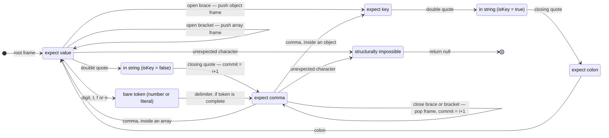

# Partial JSON scanner

The state machine that makes progressive rendering possible.



## The one distinction everything rests on

`InKeyString` and `InValString` are the same characters on the wire. The scanner
separates them because they are **rewound differently at end of buffer**:

| EOF state | Cut to | Result |
|---|---|---|
| `InValString` | buffer end, minus a dangling escape | close the string: `{"title":"Quarterly rev"}` |
| `InKeyString` | the frame's `commit` | discard the key: `{"a":1,"ti` → `{"a":1}` |

Keeping a partial value is what makes prose stream. Discarding a partial key is
what stops the document lying about its own shape — `{"ti": …}` would be a field
the schema has never heard of, and the validator would call it
`unrecognized_keys`, which is classified **fatal**. A half-written key would
therefore kill the stream on every object the model writes.

## `commit`, and why one assignment carries the algorithm

Every frame tracks the index just past its last *complete* member:

```
member completes → frame.commit = i + 1; frame.expect = "comma"
```

Everything that cannot be salvaged rewinds to `commit`: a dangling `,`, a dangling
`:`, an incomplete literal (`tru`), a number that cannot terminate (`1.2e`, `-`), a
partial key. One field, six failure modes.

## End-of-buffer decision table

| State | Cut point | Then |
|---|---|---|
| In a value string | `trimDanglingEscape(len)` | append `"`, close frames |
| In a key string | `top.commit` | close frames |
| Complete bare token (`true`, `42`) | `len` | close frames |
| Incomplete bare token | `top.commit` | close frames |
| Dangling `,` / `:` / nothing | `top.commit` | close frames |

Closers are appended innermost-first, so `{"a":{"b":[1,2` becomes
`{"a":{"b":[1,2]}}`.

## The escape trap

Appending `"` to `{"s":"a\` gives `{"s":"a\"}` — an *escaped* quote, so the string
never closes and the parse fails. `trimDanglingEscape` handles both cases:

- **odd trailing backslashes** → drop one (even means they are escaped pairs);
- **truncated `\uXXXX`** → look back six characters for a `\u` followed by fewer
  than four hex digits, cut from there.

Both are invisible until they aren't, so both are tested directly.

## Structural rejection

`{"a":1}]` and `{"a" 1}` return `null` rather than a best guess. Guessing would
hand a wrong document to a validator, which is worse than admitting the stream is
broken.
