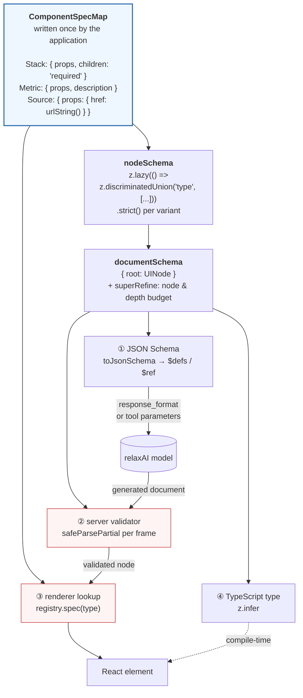

# Schema derivation — one declaration, four consumers



## Why this shape rather than four artefacts

Four hand-maintained things that must agree is four things that will not.
The classic failure: a component is renamed, the renderer is updated, the JSON
Schema is not, and the model spends every generation emitting a type that fails
validation — with a symptom ("the model is broken") that points nowhere near the
cause.

Here, adding a component makes it available to the model *and* renderable *and*
validated, in one edit. Removing one makes the model **structurally incapable** of
emitting it: the discriminated union has no branch for it, so a document naming it
fails validation before any render.

## Recursion, and why `z.lazy` is load-bearing

Component trees are recursive, so the JSON Schema emitter must handle a cycle.
`z.lazy()` returns the *same schema instance* on each call, which makes object
identity a reliable cycle key:

```
build(schema):
  if schema ∈ seen: return { $ref: "#/$defs/" + seen[schema] }
  if container:     name ← unique(hint); seen[schema] ← name
  body ← buildBody(...)
  if body mentions "#/$defs/" + name: defs[name] ← body; return { $ref: ... }
  else: drop the reserved name, return body inline
```

That last line matters: without it, every non-recursive object would acquire a
pointless `$defs` entry and an indirection, making the schema harder for a human
*and* a model to read.

## Where the guards attach

- **`urlString()`** is a `superRefine` + `transform`, so `javascript:alert(1)` fails
  **schema validation** — at ②, before ③ exists, before the DOM is involved.
  `z.string().url()` would accept it: it is a syntactically valid URL.
- **`.strict()`** on each variant makes an unexpected key a failure rather than a
  silent drop. Silently dropped is how something later gets silently spread onto a
  DOM node.
- **The budget** is a `superRefine` on the document, using an *iterative*
  `measureTree` — a recursive walk overflows the stack on a deep tree, i.e. the
  depth guard would fail before it could fire.
