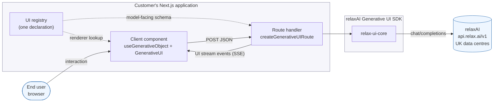
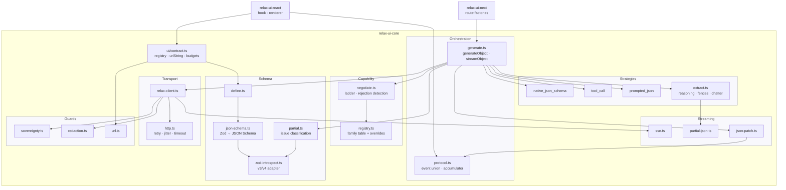
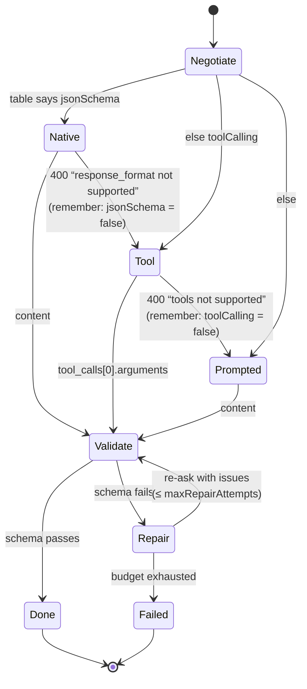
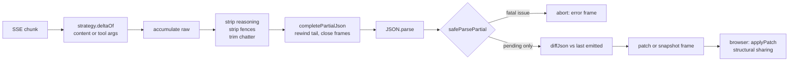
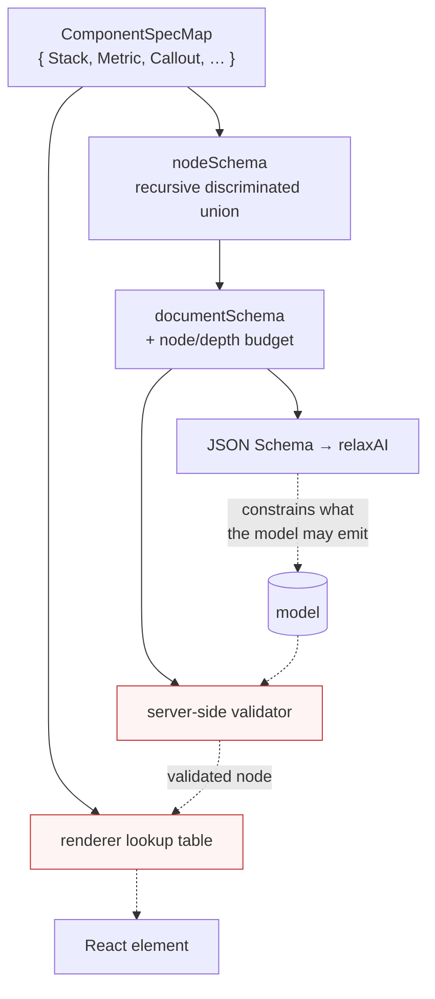
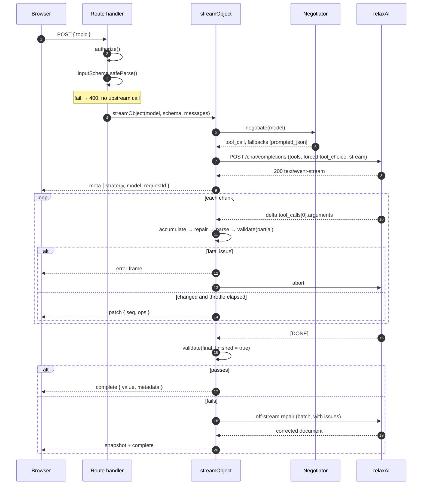
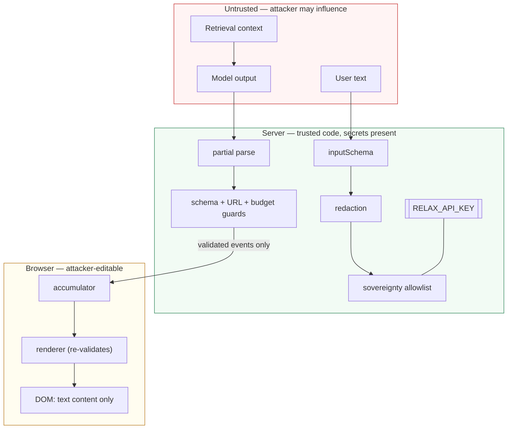
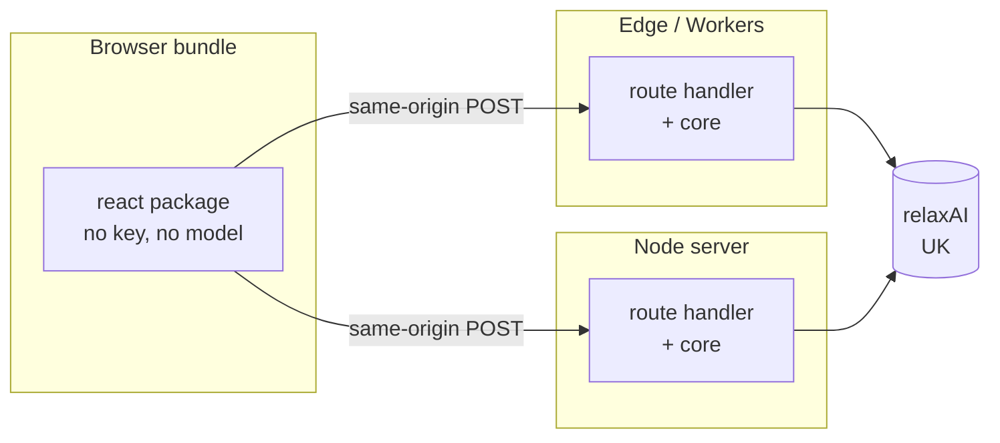

# High-Level Design — relaxAI Generative UI SDK

**Version**: 1.0 · **Date**: 2026-09-29 · **Status**: Implemented
**Companion documents**: [LLD](./lld.md) · [Security model](./security-model.md) · [ADRs](./adr/) · [Diagrams](./diagrams/)

---

## 1. Purpose and scope

### 1.1 The problem

Civo's relaxAI gives UK organisations frontier open-weight models inside UK legal
jurisdiction, behind an API that is 1:1 compatible with OpenAI's. For a team that
wants **generative UI** — interfaces whose structure a model decides at request
time — that compatibility solves transport and nothing else.

What remains is a genuinely awkward gap:

| Gap | Why it bites |
|---|---|
| Capability is not parity | `response_format: json_schema` is a *server* feature. Whether a given open-weight model honours it is not discoverable from the protocol. |
| Streaming vs parsing | A product needs the UI to appear progressively. A half-written JSON document cannot be parsed, and waiting for the last token abandons the requirement. |
| Untrusted structure | Model output that becomes UI is attacker-influenced markup. No frontend reviewer will approve rendering it as-is. |
| Two sources of truth | Teams have a Zod schema. They do not want a hand-maintained JSON Schema beside it, drifting. |
| Response wrappers | DeepSeek R1 emits `<think>`, GPT-OSS emits harmony channels, Llama adds fences and pleasantries. All break `JSON.parse`. |

Every one of these is currently solved per-application, badly, by whoever gets
the ticket.

### 1.2 What this SDK is

Three TypeScript packages that close that gap:

| Package | Responsibility | Depends on |
|---|---|---|
| `relax-ui-core` | Transport, capability negotiation, structuring strategies, streaming parse + validate, guards, wire protocol | nothing at runtime (Zod is a peer) |
| `relax-ui-react` | Streaming object hook, allowlist-only renderer | core, React |
| `relax-ui-next` | App Router handler factories | core |

### 1.3 Out of scope

Embeddings/audio/deep-research endpoints; conversation state and RAG; agentic
tool *execution* (tool calling is used here as a typed return channel only); a
component library; rate limiting (the `authorize` hook is the seam).

---

## 2. Design principles

From the [constitution](../.specify/memory/constitution.md), in the order they
constrain the design:

1. **Sovereignty is not a setting.** Host allowlist enforced at construction;
   zero SDK-initiated egress; observability is in-process counters only.
2. **The schema is the contract.** One declaration derives the model-facing JSON
   Schema, the validator, the TypeScript type and the renderer's lookup table.
3. **Capability is negotiated, never assumed.** Model capability is overridable
   data, refined at runtime, reported in metadata.
4. **Model output is untrusted input.** Closed component vocabulary, per-node
   validation, no raw-HTML path, bounded documents.
5. **The edge is a target.** `fetch` is the only platform API core requires.
6. **Specification precedes implementation.**
7. **Every behaviour has a test that would fail without it.**

---

## 3. Context

Two facts the diagram is drawn to make obvious:

- The **API key lives only in the route handler**. The browser never holds a
  credential and never contacts relaxAI.
- The **registry is declared once** and read by both sides. It is simultaneously
  the prompt, the validator and the renderer's allowlist.

---

## 4. Container view

Note the dependency direction: **guards and schema have no upward dependencies**.
They are leaves, individually testable, and nothing in the orchestration layer can
bypass them because the client constructor and the schema validator are the only
routes to the network and to a rendered node respectively.

---

## 5. The three central mechanisms

### 5.1 The structuring ladder

Two rules make this safe rather than merely clever:

- **Only a capability rejection drops a tier.** A model that can call tools but
  writes bad arguments will not do better with a weaker mechanism — that is what
  repair is for. A 401 or a genuine bad request propagates.
- **A rejection is remembered for the process.** The cost of a wrong prior is one
  wasted request per model per process, not one per call.

### 5.2 The streaming pipeline

The step that does the real work is `completePartialJson`. Its rules:

| Input tail | Output | Why |
|---|---|---|
| `{"title":"Quarterly rev` | `{"title":"Quarterly rev"}` | Progressive prose is the point of streaming |
| `{"a":1,"ti` | `{"a":1}` | A half-named key would misrepresent the shape |
| `{"a":1,` | `{"a":1}` | Dangling separator rewinds |
| `{"ok":tru` | `{}` | Incomplete literal rewinds |
| `{"n":1.2e` | `{}` | Number cannot yet terminate |
| `{"s":"a\` | `{"s":"a"}` | Dangling escape trimmed before closing quote |

### 5.3 The closed component vocabulary

One declaration, four consumers. The security property follows from the
construction rather than from a check: the generated type union **has no branch**
for a component the application did not register, so a document naming one fails
validation. The renderer then refuses it again, because a defence that exists in
one layer is a defence that a misconfiguration removes.

---

## 6. Request lifecycle

Two things worth reading twice:

- **Step 5–6** happen before any inference. A bad body costs nothing.
- The failure branch inside the loop **aborts the upstream request**. A wrong-typed
  field detected on token 4 does not cost the remaining 2,000 tokens.

---

## 7. Trust boundaries

The load-bearing claim: **parsing, validation and guarding all happen on the
server**. Model tokens never reach the browser. This costs one hop of latency and
buys a boundary that an attacker cannot edit — see
[ADR-0001](./adr/0001-server-side-validation-boundary.md).

---

## 8. Quality attributes

| Attribute | Target | How it is achieved | How it is verified |
|---|---|---|---|
| **Correctness** | A returned object always satisfies its schema | Validation is the only exit from `generateObject`; no `any` in exported signatures | 128 tests; unrepairable path asserted to throw |
| **Portability** | Node, Edge, Workers, Bun, Deno | `fetch`-only core; no `node:` imports; zero runtime deps | CI grep; example runs `runtime = "edge"` |
| **Security** | No path from model output to script execution | Closed vocabulary, validation-time URL guard, no raw-HTML sink, iterative budgets | CI grep for `dangerouslySetInnerHTML`; refusal tests |
| **Data residency** | Prompts reach only allowlisted hosts | Constructor-time check; zero SDK-initiated egress | Sovereignty tests incl. the opt-in-must-not-widen case |
| **Resilience** | Survives a wrong capability prior | Ladder + per-process learning; floor needs no server feature | Full ladder-walk test |
| **Efficiency** | Streaming cost linear in document size | JSON Patch with snapshot fallback | Patch round-trip tests |
| **Observability** | Degradation is never silent | `metadata.downgradedFrom`; `onEvent` traces; in-process counters | Downgrade tests assert metadata |
| **Testability** | Every I/O seam injectable | `fetch`, `sleep`, `random`, `now` all injected | Whole suite runs with a stub `fetch`, no network |

---

## 9. Performance characteristics

| Operation | Complexity | Note |
|---|---|---|
| `completePartialJson` | O(n) per call | Single pass, allocation-light |
| Streaming parse, whole generation | O(n²) worst case | n = document bytes, typically a few KB. See [LLD §3.3](./lld.md#33-why-on2-is-the-right-trade-here) for why this is deliberate |
| `diffJson` | O(n) in tree size | Positional array diffing |
| `applyPatch` | O(d) per op, d = path depth | Structural sharing preserves referential equality |
| `measureTree` | O(n), O(n) stack-free | Iterative by necessity, not by preference |
| Zod → JSON Schema | O(n) in schema nodes | Once per schema, at module scope |
| Frame emission | throttled by `frameIntervalMs` | 0 = per token; 40–60ms suits dense trees |

---

## 10. Deployment

- Core is stateless apart from the in-process capability cache, which is a
  performance optimisation — a cold instance is correct, just marginally slower on
  its first call per model.
- Horizontal scaling needs no coordination.
- The browser bundle contains no credential and no model identifier it could
  change.

---

## 11. Extension points

| Need | Seam |
|---|---|
| Custom auth, quotas, feature flags | `authorize(request)` |
| Corrected capability data | `new CapabilityRegistry({ "model-id": { … } })` |
| A Zod construct we cannot derive | `defineStructuredSchema({ jsonSchema })` |
| Organisation-specific redaction | `redaction: RedactionRule[]` |
| A self-hosted in-jurisdiction gateway | `sovereignty: { allowedHosts: [...] }` |
| Metrics export | `MetricsCollector` + your own endpoint |
| A non-React client | `readUIStream` + `UIStreamAccumulator` |
| Proxy or mTLS transport | `fetch` injection |

---

## 12. Risks and mitigations

| Risk | Impact | Mitigation | Residual |
|---|---|---|---|
| Capability priors unverified against live API | Wasted first request per model | Ladder absorbs it; floor needs no server feature; each claim carries provenance | Low — `pnpm probe` measures them; T-056c is the live run |
| relaxAI diverges from OpenAI shape | Requests fail | Assumptions isolated in one contract document and one client | Low; compatibility is Civo's stated commitment |
| Model writes plausible-but-wrong content | Misleading UI | Out of scope: a schema constrains shape, not truth. Documented, and the reference app's system prompt instructs the model to say when it cannot justify a figure | Accepted |
| `isCapabilityRejection` misses a phrasing | No downgrade; error surfaces | Fails safe — worst case is a normal error, not a wrong result | Low; one tested function to extend |
| Zod publishes a major 5 | Introspection breaks | All internals access confined to `zod-introspect.ts` | Low |
| Model emits a pathological tree | Server CPU | Node/depth budget with a hard iteration cap | Low |

---

## 13. Traceability

| Principle | Realised in | Verified by |
|---|---|---|
| I Sovereignty | `guard/sovereignty.ts`, `guard/redaction.ts`, no-egress design | `guards.test.ts`; CI dependency check |
| II Schema is contract | `ui/contract.ts`, `schema/json-schema.ts` | `json-schema.test.ts`, `ui-contract.test.ts` |
| III Capability negotiated | `capability/*`, `generate.ts` | `generate.test.ts` ladder tests |
| IV Untrusted output | `ui/contract.ts`, `guard/url.ts`, `renderer.tsx` | `ui-contract.test.ts`, `renderer.test.tsx` |
| V Edge is a target | `client/http.ts`, zero deps | CI greps; `next build` on Edge |
| VI Spec first | `specs/001-generative-ui-sdk/` | This artefact chain |
| VII Tested behaviour | 128 tests | `pnpm test` |
